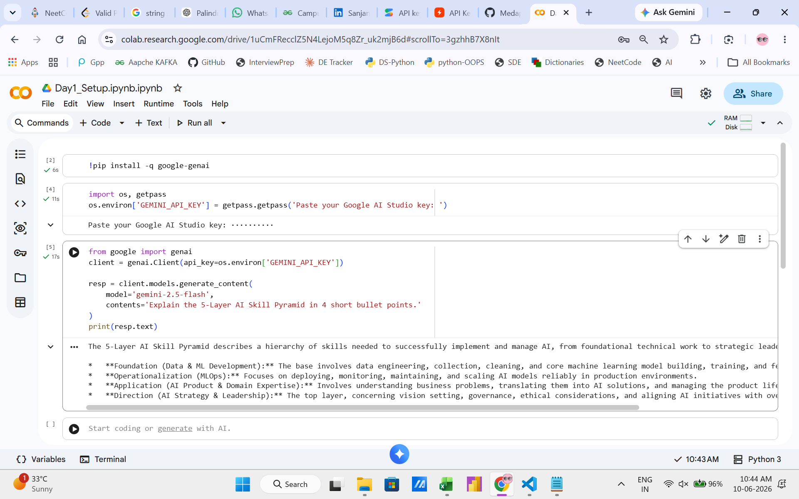

## AI Mentor Bootcamp — Sanjana Medapati

Public portfolio of 12-day AI Trainer Workshop. By Day 12: 6 daily notebooks + capstone Streamlit URL.

```markdown
## Day 1 — Setup complete

- ✅ Google AI Studio API key provisioned
- ✅ Groq API key provisioned
- ✅ Hello-Gemini call working — see [Day1_Setup.ipynb](Day1_Setup.ipynb)
- 4-tool comparison matrix from Lab 1A: see screenshot below


```
## Day 2 Lab 2B — Errors handled

1. **Markdown fence wrapping** (`\`\`\`json ... \`\`\``)
   The retry prompt asks Gemini to output raw JSON without fences. Triggers on ~5-10% of calls.
   
3. **Hallucinated phone number when source has none**
   `Optional[str] = None` in Pydantic — model returns `null`, schema validates.

4. **Empty / whitespace-only input**
   Pydantic raises ValidationError with "Field required". Caller catches.

## Sample résumés processed: 3 / 3 successful
